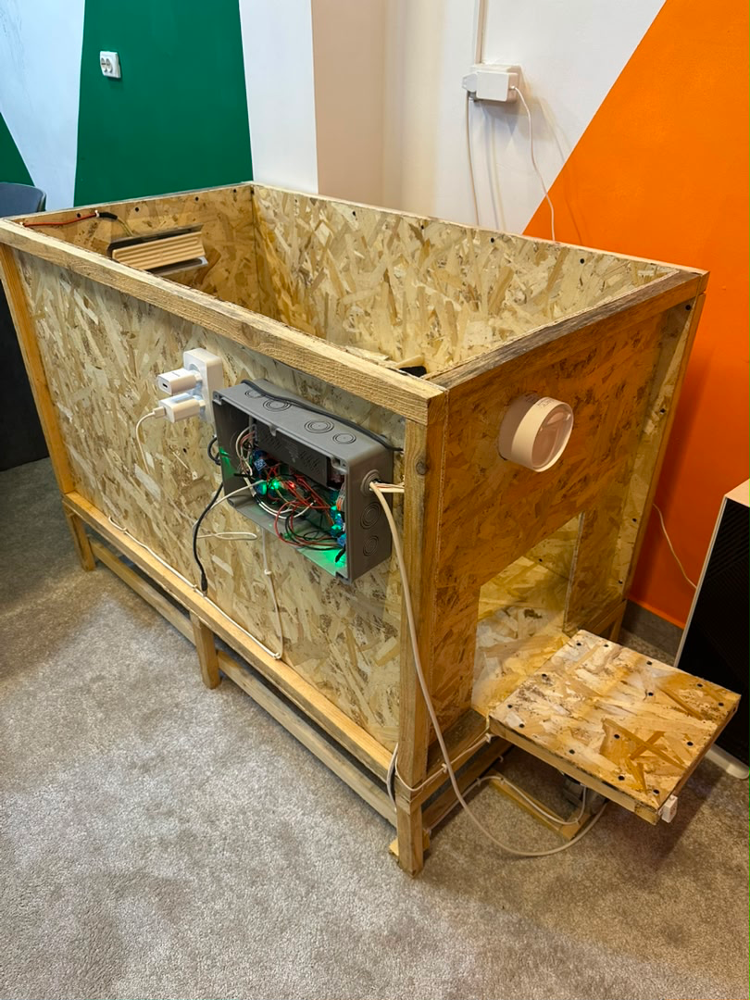

# Smart Coop Backend 🐔📡

## 📌 О проекте

**Smart Coop Backend** — это серверная часть IoT-системы для управления и мониторинга умного курятника.

Проект разработан для взаимодействия между:

* мобильным приложением 📱
* IoT-устройствами (чипами/датчиками) 🔌
* backend API ⚙️
* брокером сообщений MQTT 📡

Система используется в реальных условиях для мониторинга и автоматизации процессов в курятнике (температура, события, управление устройствами и т.д.).

---

## 🧠 Архитектура системы

```text
Mobile App
    ↓
FastAPI Backend
    ↓
PostgreSQL (данные)
    ↓
MQTT Broker (Eclipse Mosquitto)
    ↓
IoT Devices (chips / sensors / actuators)
```

---

## ⚙️ Технологический стек

### Backend

* Python 3.11
* FastAPI
* SQLAlchemy
* Alembic (migrations)
* Uvicorn

### Database

* PostgreSQL 15

### Messaging / IoT

* MQTT (Eclipse Mosquitto)

### DevOps

* Docker
* Docker Compose

---

## 📦 Основные возможности

* 🔐 Авторизация и управление пользователями
* 📡 MQTT интеграция для работы с IoT устройствами
* 🐔 Мониторинг состояния курятника
* 📊 Сбор и обработка данных с датчиков
* ⚙️ Управление устройствами через backend
* 🗄 Работа с PostgreSQL
* 🔄 Миграции через Alembic
* 📱 Интеграция с мобильным приложением

---

## 🧱 Docker архитектура

### Backend Dockerfile

```dockerfile
FROM python:3.11-slim

WORKDIR /app

RUN apt-get update && apt-get install -y --no-install-recommends \
    gcc libpq-dev && rm -rf /var/lib/apt/lists/*

COPY requirements.txt .
RUN pip install --no-cache-dir -r requirements.txt

COPY . .

EXPOSE 8000

CMD ["uvicorn", "app.main:app", "--host", "0.0.0.0", "--port", "8000"]
```

---

### Docker Compose

```yaml
version: "3.9"

services:
  db:
    image: postgres:15-alpine
    restart: always
    environment:
      POSTGRES_USER: ${DB_USER}
      POSTGRES_PASSWORD: ${DB_PASS}
      POSTGRES_DB: ${DB_NAME}
    volumes:
      - postgres_data:/var/lib/postgresql/data
    healthcheck:
      test: ["CMD-SHELL", "pg_isready -U ${DB_USER} -d ${DB_NAME}"]
      interval: 5s
      timeout: 5s
      retries: 10

  mqtt:
    image: eclipse-mosquitto:2
    restart: always
    ports:
      - "1883:1883"
    volumes:
      - ./mosquitto.conf:/mosquitto/config/mosquitto.conf

  backend:
    build: .
    restart: always
    depends_on:
      db:
        condition: service_healthy
      mqtt:
        condition: service_started
    env_file: .env
    volumes:
      - ./firebase-credentials.json:/app/firebase-credentials.json:ro
    ports:
      - "8003:8000"
    command: >
      sh -c "alembic upgrade head && uvicorn app.main:app --host 0.0.0.0 --port 8000"

volumes:
  postgres_data:
```

---

## 📡 MQTT интеграция

Проект использует MQTT брокер (Eclipse Mosquitto) для связи с IoT устройствами.

Используется для:

* отправки команд устройствам
* получения данных с датчиков
* синхронизации состояния системы

---

## 🧪 Запуск проекта

### 1. Клонирование

```bash
git clone <repo-url>
cd smart_coop_backend
```

---

### 2. Создание `.env`

```env
DB_USER=postgres
DB_PASS=your_password
DB_NAME=smartcoop
```

---

### 3. Запуск через Docker

```bash
docker compose up --build
```

---

## 🌐 API

После запуска:

* API: `http://localhost:8000`
* Docs: `http://localhost:8000/docs`

---

## 📸 Демонстрация

### 📷 Фото системы



### 🎥 Видео работы


[WhatsApp Video 2026-06-06 at 17.56.49.mp4](../../../Downloads/WhatsApp%20Video%202026-06-06%20at%2017.56.49.mp4)
---

## 🔐 Безопасность

* Environment variables (.env)
* Firebase credentials через volume
* Separation of services (DB / MQTT / Backend)

---

## 🏗 Реальный кейс

Этот проект используется в реальной IoT-системе:

* управление курятником
* работа с физическими устройствами
* сбор данных с чипов
* взаимодействие через MQTT в реальном времени

---

## 👨‍💻 Автор

Мухаммад Искандар уулу
